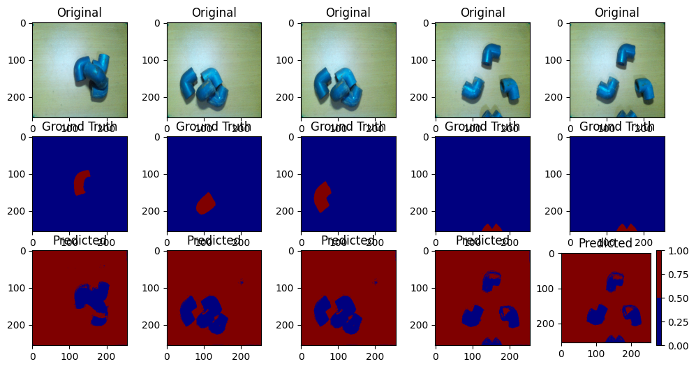

# U-Net Based Semantic Segmentation for L-Bent PVC Tubes

This project demonstrates semantic segmentation using a U-Net architecture, specifically trained on **custom datasets** of **L-bent PVC tubes**. Images are captured using a **Raspberry Pi camera** and annotated for supervised learning.

---

## 📸 Custom Dataset with Raspberry Pi

This project is tailored to train on **images collected from a Raspberry Pi webcam stream**, designed to segment **L-bent PVC tubes** in varied orientations and lighting conditions.

- Use `collect_images.py` to capture real-time images from a Raspberry Pi camera hosted over a local network.
- Saved images are used to create segmentation masks.
- Annotated `.json` files are processed using `new_masks.py`.

### 🔌 Raspberry Pi Setup

Ensure your Pi is streaming video via an HTTP endpoint (`http://<RPI_IP>:8000/video_feed`).  
The script will:

- Connect to the Pi's video feed.
- Show a live preview.
- Capture images on pressing the `Space` key.

Captured images are stored in the `collected_images/` directory.

---

## 🧾 Dataset Preparation Workflow

1. **Capture Images**  
   Use `collect_images.py` with your Raspberry Pi setup.

2. **Annotate Images**  
   Use [LabelMe](https://github.com/wkentaro/labelme) or similar to generate `.json` annotations.

3. **Generate Masks**  
   Run `new_masks.py`:
   - Inputs from `Images/` (with `.json` and images)
   - Outputs to:
     - `MaskImages/`: Copies of original images
     - `NewMask/`: Generated binary masks per object label

4. **Prepare Dataset**  
   Use `UNET.ipynb` to:
   - Resize, normalize, and split data.
   - Organize into `Dataset/train/` and `Dataset/test/`.

---

## 🧠 Model Architecture: U-Net

- Built with **TensorFlow** and **Keras**.
- Encoder-Decoder structure with skip connections.
- **Loss**: Categorical Crossentropy  
- **Optimizer**: Adam  
- Data augmentation applied using `ImageDataGenerator`.

---

## 🏋️‍♂️ Training & Evaluation

### Steps:

1. Open `UNET.ipynb`.
2. Run cells to:
   - Load & preprocess dataset.
   - Train with augmentation.
   - Evaluate and visualize predictions.

### Metrics:
- **Accuracy**
- **Loss**

Results are saved in the `results/` folder and include side-by-side comparisons of input images, ground truth masks, and predicted masks.

---

## 🖼 Example Output

Below is an example of a model trained with augmented data on custom images of L-bent PVC tubes:

> **Example Path**: `D:\MY_PROJECTS\IMAGE_SEGMENT\results\with_augmentation_03.png`



---

## 📁 Project Structure

```
.
├── collect_images.py        # Image collection from Raspberry Pi
├── new_masks.py             # JSON to mask converter
├── UNET.ipynb               # Training and evaluation notebook
├── Dataset/                 # Contains train/test images and masks
├── MaskImages/              # Original images extracted from JSON
├── NewMask/                 # Masks generated from annotations
├── results/                 # Output predictions and evaluation plots
└── ...
```

---

## 📚 References

- [U-Net: Convolutional Networks for Biomedical Image Segmentation](https://arxiv.org/abs/1505.04597)
- [TensorFlow Documentation](https://www.tensorflow.org/)

---

## 📝 License

Licensed under the **MIT License**.  
You are free to use, modify, and distribute this project.

---

Let me know if you’d like this in `.md` file format or need help turning this into a GitHub page!
