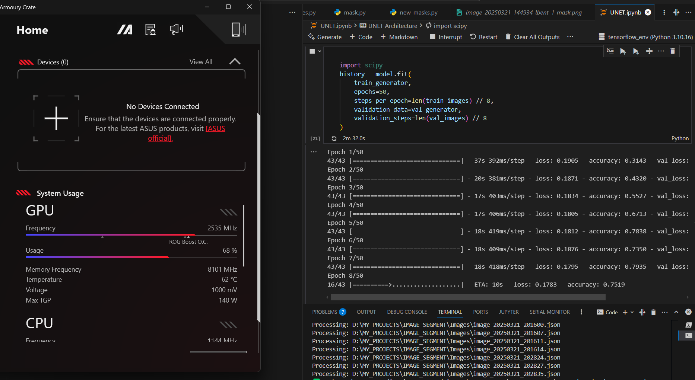

Here’s a clean and professional `README.md` file based on your project structure, scripts, and workflow:

---

# U-Net Based Semantic Segmentation for L-Bent PVC Tubes

This project implements a semantic segmentation pipeline using the U-Net architecture to identify L-bent PVC tubes from images. The system supports custom mask generation, training, evaluation, and visualization.

---

## 📁 Project Structure

```
.
├── .gitignore
├── collect_images.py
├── mask.py
├── new_masks.py
├── UNET.ipynb
├── UNET.html
├── UNET_multiclass_input.png
├── usage.png
├── Dataset/
│   ├── train/
│   │   ├── images/
│   │   ├── masks/
│   ├── test/
│   │   ├── images/
│   │   ├── masks/
├── Images/
├── Mask/
├── MaskImages/
├── NewMask/
├── results/
```

---

## 🧠 Model: U-Net

The U-Net model is implemented using TensorFlow and Keras. It is composed of:

- **Encoder**: Downsampling with Conv + MaxPooling
- **Bottleneck**: Connecting layer between encoder and decoder
- **Decoder**: Upsampling with ConvTranspose and skip connections

**Loss Function**: Categorical Crossentropy  
**Optimizer**: Adam

---

## 🛠 Dataset Preparation

1. **Raw Image Collection**:
   - Use `collect_images.py` to stream and capture images from a Raspberry Pi camera.
   - Captured images are stored in `collected_images/`.

2. **Mask Generation**:
   - Place `.json` annotated files and corresponding images in the `Images/` directory.
   - Run `new_masks.py` to extract masks and images:
     - Output images → `MaskImages/`
     - Output masks  → `NewMask/`

3. **Data Splitting**:
   - Execute the data preprocessing cells in `UNET.ipynb` to organize data into `Dataset/train` and `Dataset/test` sets.

---

## 🏋️ Training

To train the model:

1. Open `UNET.ipynb`.
2. Run all cells sequentially:
   - Load data using `load_data()` function.
   - Apply data augmentation using `ImageDataGenerator`.
   - Train using `model.fit()`.

---

## 📈 Evaluation

The model is evaluated using:

- Accuracy
- Loss

The notebook visualizes:

- Loss and accuracy plots
- Predictions vs Ground Truth

---

## 🖼 Results

Results are saved in the `results/` folder and visualized in the notebook. Includes:

- Input images
- Ground truth masks
- Predicted masks

Example:

  


---

## ▶️ Usage

1. Clone the repository.
2. Prepare your dataset as described.
3. Launch `UNET.ipynb`.
4. Train and evaluate the model.

---

## 📚 References

- [U-Net: Convolutional Networks for Biomedical Image Segmentation](https://arxiv.org/abs/1505.04597)
- [TensorFlow Documentation](https://www.tensorflow.org/)

---

## 📝 License

This project is licensed under the **MIT License**.  
Feel free to use and modify it for your needs.

---

Let me know if you want a version with clickable links, markdown badges, or deployment instructions!
